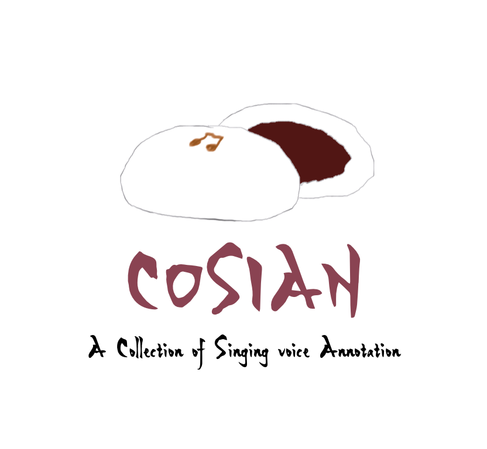
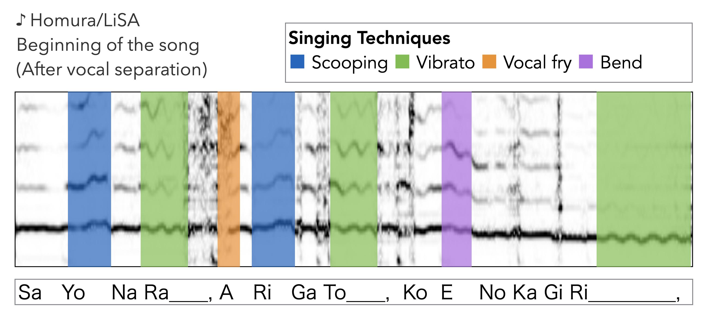

# Analysis and detection of singing techniques <br> in repertoires of J-POP solo singers

## This page is under construction...
<!-- You can use the [editor on GitHub](https://github.com/yamathcy/ISMIR2022J-POP/edit/gh-pages/index.md) to maintain and preview the content for your website in Markdown files. -->


<!-- ### Abstract of the paper
```
Singing techniques in vocal performances are important and have close relationships to singers’ singing styles. Each professional singer of popular music has a unique singing style, that is, the use of singing techniques. We focused on singing techniques within the scope of music information retrieval research.We investigated how singers use singing techniques using real-world recordings of famous solo singers in Japanese popular music songs (J-POP). First, we built a new dataset of singing techniques. The dataset consists of 168 commercial J-POP songs, and each song is annotated using various singing techniques with timestamps and vocal pitch contours.We also present descriptive statistics of singing techniques on the dataset to clarify what and how often singing techniques appear.We further explored the difficulty of the automatic detection of singing techniques using previously proposed machine learning techniques. In the identification, we also investigated the effectiveness of auxiliary information (i.e., pitch and distribution of label duration), not only providing the baseline. 
We provide the some metadata and annotation of the dataset https://yamathcy.github.io/ISMIR2022J-POP/.

``` -->
### Abstract of the paper

In this paper, we focus on singing techniques within the scope of music information retrieval research.
We investigate how singers use singing techniques using real-world recordings of famous solo singers in Japanese popular music songs (J-POP). 
First, we built a new dataset of singing techniques. 
The dataset consists of 168 commercial J-POP songs, and each song is annotated using various singing techniques with timestamps and vocal pitch contours.
We also present descriptive statistics of singing techniques on the dataset to clarify what and how often singing techniques appear.
We further explored the difficulty of the automatic detection of singing techniques using previously proposed machine learning techniques. 
In the detection, we also investigate the effectiveness of auxiliary information (i.e., pitch and distribution of label duration), not only providing the baseline. 
\yy{The best result achieves 40.4\% at macro-average F-measure on nine-way multi-class detection.}
We provide the annotation of the dataset and its detail on the appendix website (this site) https://yamathcy.github.io/ISMIR2022J-POP/ .


### Dataset "COSIAN"
<div style="text-align: center;">
    
</div>


#### Description
We built a new dataset named **COSIAN** to achieve the analysis.
COSIAN is an annotation collection of Japanese popular (J-POP) songs, focusing on singing style and expression of famous solo-singers.

It consists of various **168 songs**.
There are 21 female- and 21 male singers, and each singer's 4 songs to have different mood between these songs each other.

#### Metadata
It contains songlist. it contains following information;
<iframe width="1000" height="500" src="https://docs.google.com/spreadsheets/d/e/2PACX-1vRAkgcnUAJkbBLqnpvs2qk9uAdqkVyjygsI7wvrBC4zrpKhc_lVTIR0xTm5Yk6I-aFt1O5DQqxVITj1/pubhtml?gid=1530300283&amp;single=true&amp;widget=true&amp;headers=false"></iframe>

#### Annotations


- **Singing techniques**: Overlapping strong labeled annotation (i.e. kinds and timestamps) of singing techniques. 

- **Pitch (not publicly available)**: 

- **Spotify playlist Links**: Because of copyright issue, we don't provide raw audio tracks. Instead, we provide Spotify links of each songs in COSIAN. Here is the Spotify playlist link.

- **YouTube playlist links**: We also provides YouTube links on the YouTube playlist. Note that this playlist contains only official mv, without alignment information (maybe future work).

**We are planning to make more types of annotation within the copyright law.**

**Plan of to do**: beat and tempo, breath timing, vocal activity (presence/silence), vocal effects, onset/offset times, etc... 
(Lyrics and musical notes will NOT be availlable because they are protected by japanese copyright law.)


<!--
Under construction...
### Examples
#### Female singer
#### Male singer

### Data Statistics 


### Detection

  -->


### Citation 
Cite the ISMIR 2022 paper.
```
@inproceedings{
         {yamamoto2022analysis},
         author = {Yamamoto, Yuya and Nam, Juhan and Terasawa, Hiroko},
         title = {Analysis and Detection of Singing Techniques in repertoire of J-POP solo singers},
         booktitle = {Proceedings of 23rd International Society for Music Information Retrieval Conference (ISMIR)},
         year = {2022}
          }
```
