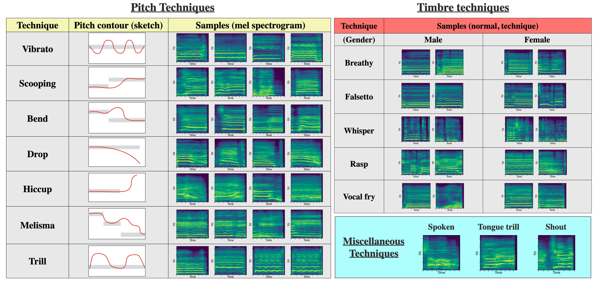

# COSIAN: A COllection of SInging performance ANnotation.

---

**COSIAN is a collection of annotation for an ongoing project of computational singing technique analysis, conducted by [Yuya Yamamoto](yamathcy.github.io)).** 




## Overview
COSIAN is a dataset of annotation relates to vocal performance of Japanese popular songs.
Our first purpose of creating this dataset is to use it for singing technique analysis.

Now, this project is ongoing project. If you want any discussion, please contact Yuya. 

## Annotations
+ **Metadata**
The file "cosian_metadata.csv" contains metadata (i.e. song id, song name, singer id, singer name, released year, gender and Spotify link) of COSIAN. 

+ **Singing techniques**:
The file "cosian_st_annotation.csv" contains the strong labeled annotation (i.e. kinds and timestamps) of singing techniques.
As of November 2021, 60 j-pop songs (only first verse) are annotated. 

+ **Spotify playlist Links**:
Because of copyright issue, we don't provide raw audio tracks. Instead, we provide Spotify links of each songs in COSIAN.
Here is the [Spotify playlist link](https://open.spotify.com/playlist/3PWNWSUxxw281MMh4VaxG3?si=7cabf83a193a42e9).

+ **YouTube playlist links**:
We also provides YouTube links on the [YouTube playlist](https://www.youtube.com/playlist?list=PLyN1Xf0UVWhw1kjAsCEmYMvKbixIAQ5N5).
Note that this playlist contains only official mv, without alignment information (maybe future work).

We are planning to make more types of annotation within the copyright law.

Todo: breath timing, vocal activity (presence/silence), vocal effects, beat time etc...
(Lyrics and musical notes will NOT be availlable because they are protected by Japanese copyright law.)

---
## Label details

### Singing techniques
We consider the following 15 singing techniques. 

#### Category 1: Pitchy
+ Vocal Oscillation
  + **vibrato**: a periodic oscillation of pitch.
  + **trill**: a continuous pitch change between two notes (in the JPTW2021 paper, clasified as category 3.).
  + **trillo**: a periodic oscillation of loudness. Also "goat tone".
+ Portamento
  + **scooping**: a pitch evolution like upward glissando.
  + **drop**: a pitch evolution like downward glissando.
  + **bend**: a short tremolo or U/inverted U-shaped pitch evolution.
  + **hiccup**: a short hiccupping on attack/release of note.
  + **melisma**: a musical arrangement in which several notes are applied to one syllable of a lyric.

#### Category 2: Timbral
+ Breathy
  + **falsetto**: sung by falsetto register.
  + **breathy**: breathy sound.
  + **whisper**: sung like whispering.
+ Creaky
  + **vocal fry**: sung by a creaky voice, and pulse register phonation.
  + **rasp**: sung by a creaky voice, with subharmonics.

#### Category 3: Miscellaneous
+ **spoken**: singing like rapping, sprechgesang (i.e., a vocal style between singing and speaking.), and other styles like speaking.
+ **shout**: shouting.
+ **tongue trill**: a rolling tongue accompanied (r) consonant.
<!-- + **staccato**: the notes sung very briefly with gaps between other notes. -->
+ **unk**: unknown or unnamed techniques.

Articulation and dynamics may be future work.

---
## Case studies
#### 1. CRNN-based nine-way singing technique detection (ISMIR 2022)
We attempted the detection task.
https://yamathcy.github.io/ISMIR2022J-POP/


#### 2. Improved DNN architecture of singing technique detection (EUSIPCO 2023)
TBA 


---
## Citation
```
@inproceedings{yamamoto2022analysis,
         author = {Yamamoto, Yuya and Nam, Juhan and Terasawa, Hiroko},
         title = {Analysis and Detection of Singing Techniques in Repertoires of J-POP Solo Singers},
         booktitle = {Proceedings of The 23rd International Society for Music Information Retrieval Conference (ISMIR)},
         year = {2022}
}
```
```
@inproceedings{yamamoto2023primadnn,
         author = {Yamamoto, Yuya and Nam, Juhan and Terasawa, Hiroko},
         title = {PrimaDNN': A Characteristics-aware DNN Customization for Singing Technique Detection},
         booktitle = {Proceedings of The 31st European conference on signal processing (EUSIPCO)},
         year = {2023}
}
```


## History
2022 


For any questions or further information, please contact **Yuya Yamamoto** (email: s2130507 (at) s.tsukuba.ac.jp).

If you discover or correct a mis-labeled annontation, **please inform at issue or pull request.**

---
### The name "COSIAN"
The name "COSIAN" is pronunced "ko-shi-an". This name is from smooth red bean paste,
which is used in many japanese sweets.
